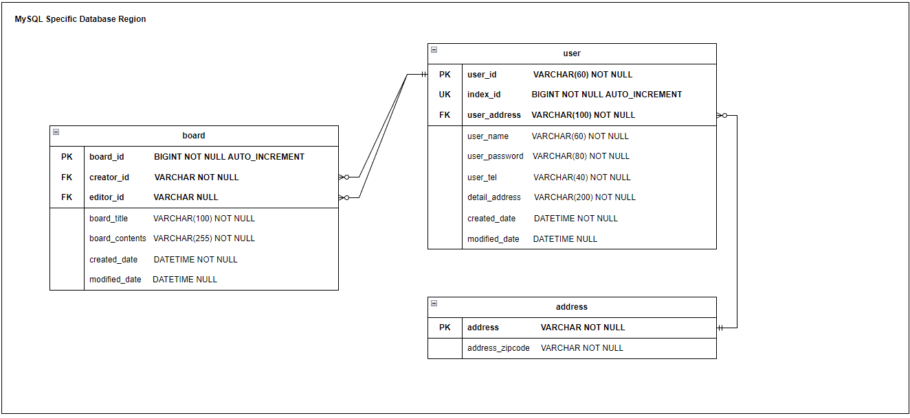

## Database Table Schema


## User API Request Test
모든 사용자 조회
GET http://localhost:8000/users

특정 사용자 조회
GET http://localhost:8000/users/:{Your Test UserId}

사용자 계정 정보 등록
POST http://localhost:8000/users
```
    Content-Type: application/json

    {
        "id": "Test UserId1",
        "name": "Test UserName1",
        "password": "Test UserPassword1",
        "tel": "Test UserTel1",
        "address": "Test UserAddress1",
        "detailAddress": "Test UserDetailAddress1"
    }
```

특정사용자 계정 정보 수정
PUT http://localhost:8000/users/:{Your Test UserId}
```
    Content-Type: application/json

    {
        "name": "Test UserName2",
        "password": "Test UserPassword2",
        "tel": "Test UserTel2",
        "address": "Test UserAddress2",
        "detailAddress": "Test UserDetailAddress2"
}
```

특정 사용자 계정 정보 삭제
DELETE http://localhost:8000/users/:{Your Test UserId}

## Address API Request Test
등록되어있는 모든 주소 조회
GET http://localhost:8000/addresses

특정 주소를 기준으로 등록되어있는 주소 정보 조회
GET http://localhost:8000/addresses/address:{Your Test Address}

특정 Zipcode를 가지는 주소 정보 조회
GET http://localhost:8000/addresses/zipcode:{Your Test Zipcode}

특정 주소를 기준으로 모든 사용자 및 사용자가 관련 되어있는 게시글 조회
GET http://localhost:8000/addresses/users:{Your Test Address}

주소 정보 신규 등록
POST http://localhost:8000/addresses
```
    Content-Type: application/json

    {
        "address": "TestAddress",
        "zipcode": "TestZipcode"
    }
```

특정 주소 정보 삭제
DELETE http://localhost:8000/addresses/:{Your Test Address}

## Board API Request Test
모든 게시글 정보 조회
GET http://localhost:8000/boards

특정 게시글 번호로 게시글 정보 조회
GET http://localhost:8000/boards/:{Board Index Here}

게시글 작성
POST http://localhost:8000/boards
```
    Content-Type: application/json

    {
        "title": "Test Title 1",
        "contents": "Tester Contents 1",
        "writeId":"Test UserId1"
    }
```

특정 게시글 수정
PUT http://localhost:8000/boards/:{Board Index Here}
```
Content-Type: application/json

{
    "title": "Test Title 2",
    "contents": "Tester Contents 2",
    "modifyId": "Test UserId2"
}
```

특정 게시글 정보 삭제
DELETE http://localhost:8000/boards/:{Board Index Here}
